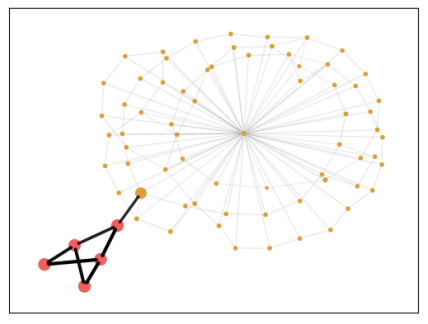

## Sparse and Soft Subgraph for Graph Invariant Learning

### Preliminaries

- Graph Neural Networks (GNNs) are a powerful tool for representation learning on graph data, which can learn the representations of graph, node, and edge. Most GNNs are based on message passing mechanism.
- Invariant Learning (IL) is a set of strategies to overcome the distribution shifts between the training domain and the testing domain. For example, the training and testing datasets might be from different times / places / other scenerios, that is where the out-of-distribution (OOD) problem arises.
- Sinkhorn algorithm is from the optimal transport (OT) theory, is an iterative and differentiable algorithm to solve a set of constrained linear programming problems, with the consideration of the sparsity and softness of the solution.

### Motivation

- The crutial part for label prediction is always a small subset of the input features. In the field of graph learning, it is subgraph.
- The invariant subgraph, as a mediator of the prediction process ($G$ -> $G_S$ -> $Y$), could be learned via latent variable inference.
- The existing methods lack of the considerations of subgraph sparsity and softness, which lead to weaker performances.

### Methodology

- We propose Graph Sinkhorn Attention (GSA) to infer the sparse and soft invariant subgraph $$G_S = \{G, \alpha^V, \alpha^E\},$$ where $\alpha$ is the attention values on nodes (V) and edges (E) discribing the importances of each node and edge.